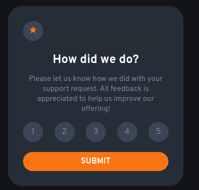
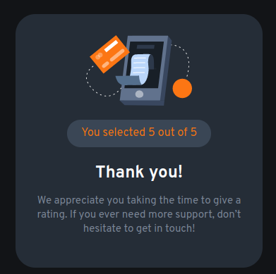

# Frontend Mentor - Interactive rating component solution

This is a solution to the [Interactive rating component challenge on Frontend Mentor](https://www.frontendmentor.io/challenges/interactive-rating-component-koxpeBUmI). Frontend Mentor challenges help you improve your coding skills by building realistic projects.

## Table of contents

-   [Overview](#overview)
    -   [The challenge](#the-challenge)
    -   [Screenshot](#screenshot)
    -   [Links](#links)
-   [My process](#my-process)
    -   [Built with](#built-with)
    -   [What I learned](#what-i-learned)
    -   [Continued development](#continued-development)
    -   [Useful resources](#useful-resources)
-   [Author](#author)
-   [Acknowledgments](#acknowledgments)

**Note: Delete this note and update the table of contents based on what sections you keep.**

## Overview

### The challenge

Users should be able to:

-   View the optimal layout for the app depending on their device's screen size
-   See hover states for all interactive elements on the page
-   Select and submit a number rating
-   See the "Thank you" card state after submitting a rating

### Screenshot

### Links

-   Solution URL: [GitHub](https://github.com/baremarco/interactive-rating-component-main)
-   Live Site URL: [GitHub Pages](https://baremarco.github.io/interactive-rating-component-main/)

## My process

### Built with

-   Semantic HTML5 markup
-   CSS custom properties
-   Flexbox
-   CSS Grid
-   [React](https://reactjs.org/) - JS library

### What I learned

-   Learned **Sass**
-   Learned **css flexbox**
-   Learned about **markdown** syntax
-   Learned **React functional components**

### Continued development

-   Keep using sass and the **7-1 architecture**
-   Improve css flexbox and css grid
-   Mobile layout
-   Learn and improve [Accessibility](https://www.smashingmagazine.com/2018/09/importance-manual-accessibility-testing/)

### Useful resources

-   [resource 1](https://css-tricks.com/a-complete-guide-to-links-and-buttons/) - This helped me for style buttons
-   [fix create react app showing readme](https://www.pluralsight.com/guides/fix-create-react-app-showing-readme.md) - This helped me to fix that on the github pages I was displaying the content of readme.md instead of the application.
-   You need to install gh-pages globally for this to work

    `npm install -g --save-dev gh-pages`

## Author

-   Frontend Mentor - [@baremarco](https://www.frontendmentor.io/profile/baremarco)
-   Twitter - [@baremarco](https://www.twitter.com/baremarco)

## Acknowledgments

-   Thanks to the frontend mentor [Slack community](https://www.frontendmentor.io/slack).
-   Thanks to [Raymond Adutwum Agyei](https://www.frontendmentor.io/profile/alosoft).
-   Thanks to [Abdul](https://www.frontendmentor.io/profile/Samadeen).
-   Thanks to [Vanza Setia](https://www.frontendmentor.io/profile/vanzasetia).
-   Thanks to [Desmond Nyamador](https://www.pluralsight.com/guides/fix-create-react-app-showing-readme.md).
